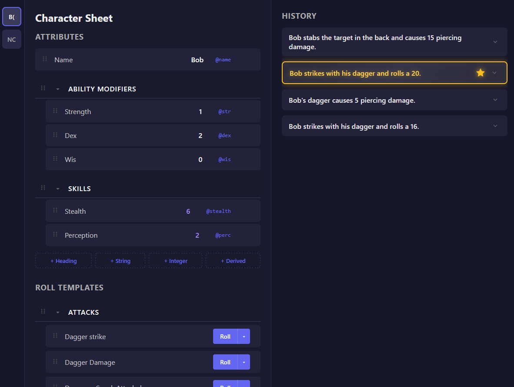

# Roll Sheet

A web app for tracking TTRPG character attributes and rolling dice online with real-time synchronization.



## Features

- **Character Sheets** - Create and manage multiple character sheets with custom attributes
- **Dice Rolling** - Full dice notation support with keep/drop modifiers (`4d6dl1`, `2d20kh1`)
- **Roll Templates** - Save and reuse roll formulas with attribute substitution
- **Real-time Sync** - All changes sync instantly across connected clients
- **Derived Attributes** - Create computed values with formulas (`floor((@str + @dex) / 2)`)
- **Roll History** - Persistent history with detailed breakdowns
- **Read-Only Mode** - Lock sheets to hide editing UI while still allowing rolls
- **Sheet Customization** - Rename sheets and set custom sidebar initials

## Quick Start

```bash
npm install
npm run dev
```

Then open http://localhost:3000

## Documentation

- [User Guide](https://abregado.github.io/roll-sheet/user-guide) - Learn how to use Roll Sheet
- [Hosting Guide](https://abregado.github.io/roll-sheet/hosting-guide) - Deploy your own instance

## Tech Stack

- **Server**: Node.js with WebSockets
- **Client**: Vanilla JavaScript with plain CSS
- **Persistence**: Server-side JSON storage

## License

MIT
